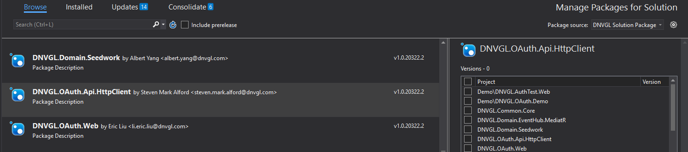

# Overview
DNVGL.OAuth.Api.HttpClient package has two type credentials. One is user credentials which use current user's credentials to access api. Other is client credentials which is a service to service model to access api. The http client will integrate the credentials to access web api.   

# Package Install

To install DNVGL.OAuth.Api.HttpClient package, you may need to add the below package feed to your nuget sources.

```
https://dnvgl-one.pkgs.visualstudio.com/_packaging/DNVGL.SolutionPackage/nuget/v3/index.json
```

Package Manager Console
```
PM> `Install-Package DNVGL.OAuth.Api.HttpClient`
```
Or Package Manager for solution/project


# Basic example

1. Setup API http client configuration in `appsettings.json` file.  

```js
  {
    "ApiHttpClientOptions":[
      {
        "Name": "userCredentialsClient",
        "Flow":"user-credentials",
        "BaseUri": "https://localhost/api/user",
        "SubscriptionKey": "eqrqie3431qre234"
      },
      {
        "Name": "clientCredentialsClient",
        "Flow":"client-credentials",
        "BaseUri": "https://localhost/api/client",
        "SubscriptionKey": "eqrqisfs34s1qre734"
        "OpenIdConnectOptions": {
          "TenantId": "ed815121-cdfa-4097-b524-e2b23cd36eb6",
          "ClientId": "35807f23-80d5-4e97-b07a-21b86013a9ff",
          "ClientSecret": "44adfa232#1ad6@#",
          "Scopes": [ "https://dnvglb2ctest.onmicrosoft.com/a4a8e726-c1cc-407c-83a0-4ce37f1ce130/user_impersonation", "offline_access" ],
          "SignInPolicy": "B2C_1A_SignInWithADFSIdp"
        }
      }
    ]

  }

```
2. Calling `AddOAuthHttpClientFactory` extension to register api client to `ServiceCollection`

If you want to create user credential `HttpClient`, you must add `AddOidc` extension method and token cache to `ConfigureSerices` too. The Oidc configuraton is used by user credntial. Please refer details to [DNVGL.OAuth.Web](./DNVGL.OAuth.Web.md). 

If you want to create client credential `HttpClient`, you have to set up `OpenIdConnectOptions`, Please see above setup API http client configuration.  

```cs
public void ConfigureService(IServiceCollection services)
{
  ...
  services.AddOAuthHttpClientFactory(Congiuration.GetSection("ApiHttpClientOptions").Get<IEnumerable<OAuthHttpClientFactoryOptions>>());
  ...

}
```


3. Resolve `OAuthHttpClientFactory` to create user-credential or client-credential `HttpClient` to access web api. 
```cs
public class TestController
{
  private readonly IOAuthHttpClientFactory _oauthHttpClientFactory;

  public TestController(IOAuthHttpClientFactory httpClientFactory)
  {
    _oauthHttpClientFactory = httpClientFactory;
  }

  public User GetUser(string id)
  {
    var client = _oauthHttpClientFactory.Create('userCredentialsClient');
    ...
  }

  public Company GetCompany(string id)
  {
    var client = _oauthHttpClientFactory.Create('clientCredentialsClient');
    ...
  }
}

```


