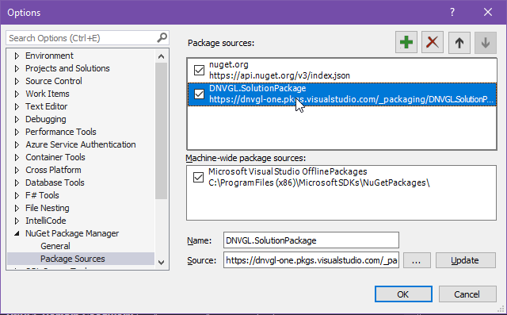

[TOC]

# Overview

DNVGL.OAuth.Web is a .NETCore library for developers to simplify the work of setting up OpenId Connection authentication (OIDC) such as Veracity or Azure AD B2C for ASP.NET Core web project.

---

# Package Install

To install the DNVGL.OAuth.Web package, you may need to add the package feed below to your nuget sources.

```
https://dnvgl-one.pkgs.visualstudio.com/_packaging/DNVGL.SolutionPackage/nuget/v3/index.json
```



Search nuget package of DNVGL.OAuth.Web and add it to your project.


---

# Authentication for websites

To simplify your authentication implementation of Veracity for your ASP.NET Core website, you need to add 3 blocks of codes to `Startup.cs`.

1. Add namespace reference. 

```csharp
using DNVGL.OAuth.Web;
```

2. Add `AddOidc` extension method into `ConfigureServices`.
```csharp
public void ConfigureServices(IServiceCollection services)
{
	...
	// implicit flow, the most simple way
	services.AddOidc(o =>
	{
		o.Authority = "https://login.veracity.com/tfp/<TenantId>/b2c_1a_signinwithadfsidp/v2.0";
		o.ClientId = "<ClientId>";
	});

	// authorization code flow, the better way
	services.AddOidc(o =>
	{
		o.Authority = "https://login.veracity.com/tfp/<TenantId>/b2c_1a_signinwithadfsidp/v2.0";
		o.ClientId = "<ClientId>";
		o.ClientSecret = "<ClientSecret>";
		o.ResponseType = "code";
	});
	...
}
```

3. Add `UseAuthentication` and `UseAuthorization` extension methods into `Configure`.
```csharp
public void Configure(IApplicationBuilder app, IWebHostEnvironment env)
{
	...
	app.UseAuthentication().UseAuthorization();
	...
}
```

4. Then you could launch your project and access an action in a controller that decorated with `[Authorize]`, a challenge request will be sent to IDP(Microsoft or Veracity) to start the authentication process, and the `HttpContext` will be filled with authentication result. 

```csharp
[Authorize]
public class HomeController : Controller
{
}
```


Beware of the usage of `[Authorize]` attribute, and do have an authentication failure plan, otherwise you might run into a re-authenticate loop. 🤣

5. A sample project is ready for you to try out: [SimpleOAuthSample](https://dnvgl-one.visualstudio.com/Innersource/_git/DNVGL.SolutionPackage.Demo?path=/SimpleOAuthSample).

---

# Authentication for web APIs

Unlike the website, web API expect every incoming request with an access token tagged alone, and web API will not help you to get a token. You get either a successful access or a 401.

1. Add namespace reference. 

```csharp
using DNVGL.OAuth.Web;
```

2. Add `AddJwt` extension method into `ConfigureServices`.
```csharp
public void ConfigureServices(IServiceCollection services)
{
	...
	// call AddAuthentication before AddJwt.
	services.AddAuthentication("Bearer")
		.AddJwt("Bearer", o =>
		{
			o.Authority = "https://login.veracity.com/tfp/<TenantId>/b2c_1a_signinwithadfsidp/v2.0";
			o.ClientId = "<ClientId>";
		});
	...
}
```

3. Add `UseAuthentication` and `UseAuthorization` extension methods into `Configure`.
```csharp
public void Configure(IApplicationBuilder app, IWebHostEnvironment env)
{
	...
	app.UseAuthorization();
	...
}
```

4. Then decorate you API controller or endpoint with `[Authorize]` attribute and specify the authentication scheme.

```csharp
[Authorize(AuthenticationSchemes = "Bearer")]
public class ApiController : ControllerBase
{
}
```

```bash
curl https://localhost:44301/api --get --include --header "Authorization: Bearer <token>"
```

5. A sample project is ready for you to try out: [ApiAuthSample](https://dnvgl-one.visualstudio.com/Innersource/_git/DNVGL.SolutionPackage.Demo?path=/ApiAuthSample).

---

# Access token cache for websites

If you web project act as an API gateway, you will want to cache users' access tokens to prevent unnecessary token requests. The library uses `MSAL (Microsoft Authentication Library)` to manipulate tokens.

1. To cache the tokens, an implementaion of `IDistributedCache` such as `MemoryDistributedCache` needs to be added.

```csharp
public void ConfigureServices(IServiceCollection services)
{
	...
	services.AddDistributedMemoryCache();
	...
}
```

You can also add `RedisCache` instead.

```csharp
public void ConfigureServices(IServiceCollection services)
{
	...
	services.AddStackExchangeRedisCache(o =>
	{
		o.InstanceName = "<InstanceName>";
		o.Configuration = "<Configuration>";
	});
	...
}
```

2. Authorization code flow needs to be set to acquire access token, and refresh token is required for MSAL to re-acquire new token from IdP.

```csharp
public void ConfigureServices(IServiceCollection services)
{
	...
	services.AddOidc(o =>
	{
		o.Authority = "https://logintest.veracity.com/tfp/<TenantId>/b2c_1a_signinwithadfsidp/v2.0";
		o.ClientId = "<ClientId>";
		o.ClientSecret = "<ClientSecret>";
		// offline_access is required to retrieve refresh_token.
		o.Scopes = new[] { "https://<TenantName>.onmicrosoft.com/<ResourceId>/user_impersonation", "offline_access" };
		o.ResponseType = "code";
	});
	...
}
```

3. To retrieve the cached token, we need to get the `IClientAppBuilder` by dependency injection and create an `IClientApp`. `IClientApp` will read the token from cache or re-acquire a new token from IdP.

```csharp
[Authorize]
public class HomeController : Controller
{
	private readonly IClientAppBuilder _appBuilder;

	public HomeController(IClientAppBuilder appBuilder)
	{
		_appBuilder = appBuilder;
	}

	public async Task<IActionResult> Index()
	{
		try
		{
			var clientApp = _appBuilder.Build();
			var result = await clientApp.AcquireTokenSilent(this.HttpContext.User);
			var accessToken = result.AccessToken;
		}
		catch (TokenExpiredException)
		{
		}

		return View();
	}
}
```

4. You can also acquire a token with another scope for other API (such as MyService) with the cached token instead of re-authenticate.

```csharp
public async Task<IActionResult> Refresh()
{
	try
	{
		var anotherScope = "https://<TenantName>.onmicrosoft.com/<ResourceId>/user_impersonation";
		var clientApp = _appBuilder.Build(anotherScope);
		var result = await clientApp.AcquireTokenSilent(this.HttpContext.User);
		var accessToken = result.AccessToken; // verify the `aud` in the new access token.
	}
	catch (TokenExpiredException)
	{
	}

	return View("Index");
}
```

5. A sample project is ready for you to try out: [TokenCacheSample](https://dnvgl-one.visualstudio.com/Innersource/_git/DNVGL.SolutionPackage.Demo?path=/TokenCacheSample).
---
