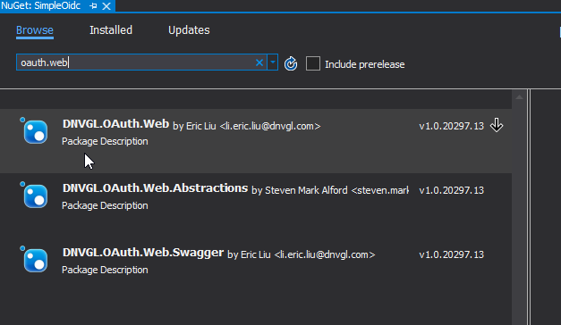

# Overview

DNVGL.OAuth.Web is a .NETCore library for developers to simplify the work of setting up OpenId Connection authentication (OIDC) such as Veracity or Azure AD B2C for ASP.NET Core web project.

---

# Package Install

To install the DNVGL.OAuth.Web package, you may need to add the package feed below to your nuget sources.

```
https://dnvgl-one.pkgs.visualstudio.com/_packaging/DNVGL.SolutionPackage/nuget/v3/index.json
```


Search nuget package of DNVGL.OAuth.Web and add it to your project.


---

# Basic Authentication Usage

To simplify your authentication implementation of Veracity for your ASP.NET Core web project, you need to add 3 blocks of codes to `Startup.cs`.

1. Add namespace reference. 

```csharp
using DNVGL.OAuth.Web;
```

2. Add `AddOidc` extension method to `ConfigureServices`.
```csharp
public void ConfigureServices(IServiceCollection services)
{
	...
	services.AddOidc(o =>
	{
		o.TenantId = "<TenantId>";
		o.SignInPolicy = "b2c_1a_signinwithadfsidp";
		o.ClientId = "<ClientId>";
		o.Scopes = new[] { "<Scope>" };
		o.CallbackPath = "/signin-oidc";
	});
	...
}
```

3. Add `UseAuthentication` and `UseAuthorization` extension methods to `Configure`.
```csharp
public void Configure(IApplicationBuilder app, IWebHostEnvironment env)
{
	...
	app.UseAuthentication().UseAuthorization();
	...
}
```

4. Then you could launch your project and access an action in a controller that decorated with `[Authorize]`, a challenge request will be sent to IDP(Microsoft or Veracity) to start the authentication process, and the `HttpContext` will be filled with authentication result. 


5. A sample project is ready for you to try out: [SimpleOidc](//SimpleOidc).

---

# Access Token Cache Usage

If you web project act as an API gateway, you will want to cache users' access tokens to prevent unnecessary token requests. The library uses `MSAL (Microsoft Authentication Library)` to manipulate tokens.

1. Authorization code flow needs to be set to acquire access token, and refresh token is required for MSAL to re-acquire token from IDP if the token exceed its expiration.

```csharp
public void ConfigureServices(IServiceCollection services)
{
	...
	var oidcOptions = new OidcOptions
	{
		TenantId = "<TenantId>",
		SignInPolicy = "b2c_1a_signinwithadfsidp",
		ClientId = "<ClientId>",
		ClientSecret = "<ClientSecret>",
		Scopes = new[] { "<Scope>", "offline_access" },	// offline_access is required to retrieve refresh_token.
		CallbackPath = "/signin-oidc",
		ResponseType = OpenIdConnectResponseType.Code
	};
	...
}
```

2. To cache the tokens, an implementaion of `IDistributedCache` such as `MemoryDistributedCache` needs to be added.

```csharp
public void ConfigureServices(IServiceCollection services)
{
	...
	services.AddDistributedMemoryCache();
	...
}
```

You can also add `RedisCache` instead.

```csharp
public void ConfigureServices(IServiceCollection services)
{
	...
	services.AddDistributedRedisCache(o =>
	{
		o.InstanceName = "<InstanceName>";
		o.Configuration = "<Configuration>";
	});
	...
}
```

3. Calling `AddDistributedTokenCache` will have `IDistributedCache` attached to MSAL client app behind the scene, and the token acquiring process will be replaced by MSAL client app.

```csharp
public void ConfigureServices(IServiceCollection services)
{
	...
	services.AddDistributedTokenCache(oidcOptions);
	...
}
```

4. Don't forget to add `AddOidc` after what you did previously.

```csharp
public void ConfigureServices(IServiceCollection services)
{
	...
	services.AddOidc(oidcOptions);
	...
}
```

5. A sample project is ready for you to try out: [TokenCacheDemo](//TokenCacheDemo).

---
